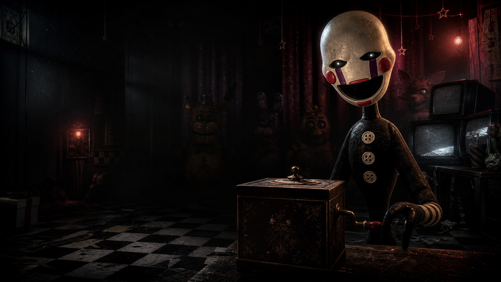

# Marionette MusicBox Showcase



A responsive, FNAF-inspired showcase and invitation website for **Marionette MusicBox**, a fan-made Discord music bot.

The project currently focuses on presentation: it introduces the bot, displays its main slash commands, provides space for a Discord demonstration trailer, and directs visitors to the bot's OAuth2 invite page. More interactive functionality can be added later without restructuring the existing page.

## Features

- Full-screen, responsive Marionette hero experience
- Animated navigation cue with smooth section scrolling
- Discord bot command showcase
- WebM and MP4 trailer support
- Centralized Discord invite URL
- Accessible navigation and reduced-motion support
- Mobile and desktop layouts
- Production-ready Vite build

## Built With

- React
- TypeScript with strict checking
- Vite
- Tailwind CSS
- Class Variance Authority
- Lucide icons

## Local Development

Requirements:

- Node.js 20 or newer
- npm

Install the dependencies and start the development server:

```bash
npm install
npm run dev
```

Vite will print the local URL in the terminal, normally `http://localhost:5173`.

## Configure the Discord Invite

Open `src/data/site.ts` and replace:

```ts
inviteUrl: "PASTE_YOUR_DISCORD_BOT_INVITE_LINK_HERE"
```

Use the OAuth2 installation URL generated for your Discord application.

## Add the Trailer

Place both trailer versions in `public/videos/`:

```text
marionette-trailer.webm
marionette-trailer.mp4
```

Recommended export settings:

- Resolution: 1920x1080
- Aspect ratio: 16:9
- Frame rate: 30 FPS
- Duration: 30-60 seconds
- WebM: VP9 video with Opus audio
- MP4 fallback: H.264 video with AAC audio
- Target combined file size: 4-8 MB per version

The page uses `preload="metadata"`, so the complete trailer is not downloaded until the visitor starts playback.

## Production Build

Run the complete type check and optimized build:

```bash
npm run build
```

The deployable output is written to `dist/`. Preview it locally with:

```bash
npm run preview
```

## Deploy on Vercel

1. Import this GitHub repository into Vercel.
2. Select **Vite** if Vercel does not detect the framework automatically.
3. Use `npm run build` as the build command.
4. Use `dist` as the output directory.
5. Deploy. No environment variables are currently required.

Every push to the production branch can trigger a new Vercel deployment. Add the generated website URL to the GitHub repository description after the first deployment.

## Project Structure

```text
public/
  images/                 Local artwork and brand imagery
  videos/                 WebM and MP4 trailer files
src/
  components/             Section and UI components
    compcss/              Section style sidecars
    home/                 Home page composition
    ui/                   Reusable UI primitives
  data/                   Site content and invite configuration
  lib/                    Shared utilities
  App.tsx                 Thin application entry
  globals.css             Global theme and animations
```

## Planned Work

- Add the final Discord bot invite URL
- Add the gameplay-style bot trailer
- Add live bot status or server statistics
- Add links for support, documentation, and source code
- Connect future interactive sections as the bot grows

## Disclaimer

This is a fan-made Discord music bot project. It is not affiliated with, endorsed by, or sponsored by Scott Cawthon, Steel Wool Studios, Five Nights at Freddy's, or Discord. Referenced names and characters belong to their respective owners.
